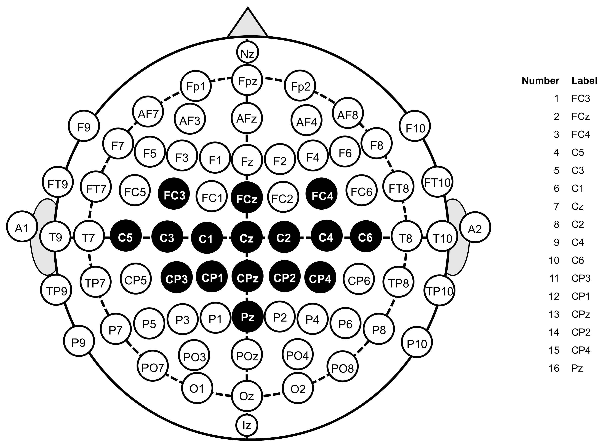
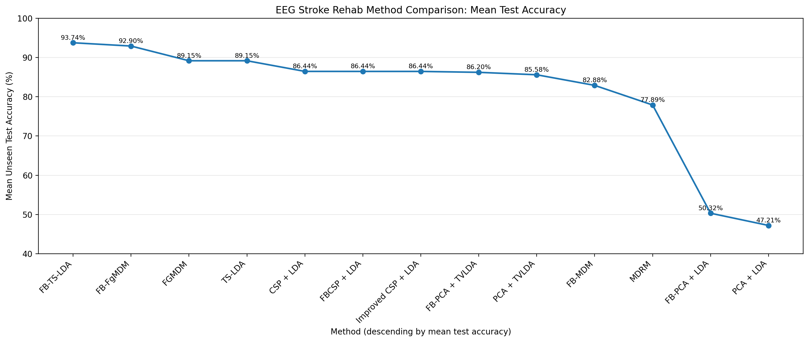
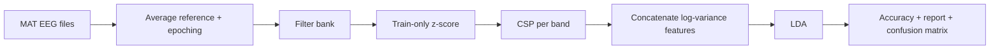
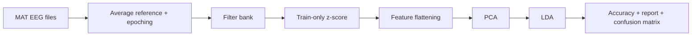

# EEG Stroke Rehab Data Analysis

This repository contains an EEG-based stroke rehabilitation / BCI data analysis project developed for the **BCI Challenge 2026**. The project compares classical machine learning, spatial filtering, and Riemannian geometry methods for binary motor-imagery EEG classification.


## Project introduction

Stroke rehabilitation often depends on repeated motor practice, neuroplasticity, and objective monitoring of motor recovery. EEG-based Brain-Computer Interface (BCI) systems are useful in this area because they can detect motor intention even when physical movement is weak or incomplete. In motor-imagery BCI, a patient imagines a movement such as left-hand or right-hand movement, and the EEG signal is analyzed to identify the intended class.

The main importance of this project is that it compares multiple EEG classification pipelines on the same stroke rehabilitation dataset. This is valuable because EEG is noisy, non-stationary, subject-dependent, and strongly affected by preprocessing choices. A single model may not perform consistently across all patients or sessions. Therefore, comparing CSP, PCA-LDA, Riemannian MDM, FGMDM, Tangent Space LDA, and filter-bank variants gives a clearer understanding of which feature representations are more reliable for stroke-rehab BCI analysis.

The strongest result in this project came from **Filter-Bank Tangent Space LDA**, with a mean unseen test accuracy of **93.74%** across all evaluated subject/session pairs.

---

## Dataset information

The dataset is provided as a downloadable `.rar` file through Google Drive:

```text
https://drive.google.com/file/d/1cLtf2JtXLApTfda2PidPFqc2Bd4p_LLZ/view?usp=sharing
```

The notebooks expect `.mat` files arranged by patient, stage, and split.

| Dataset file         |
| -------------------- |
| P1_pre_training.mat  |
| P1_pre_test.mat      |
| P1_post_training.mat |
| P1_post_test.mat     |
| P2_pre_training.mat  |
| P2_pre_test.mat      |
| P2_post_training.mat |
| P2_post_test.mat     |
| P3_pre_training.mat  |
| P3_pre_test.mat      |
| P3_post_training.mat |
| P3_post_test.mat     |

### Dataset structure used in the notebooks

The dataset contains:

- **Subjects / patients:** `P1`, `P2`, `P3`
- **Stages:** `pre`, `post`
- **Splits:** `training`, `test`
- **Classes:** left-hand motor imagery and right-hand motor imagery
- **Event labels:** `1 = left_hand`, `2 = right_hand`
- **Sampling frequency:** `256 Hz`
- **EEG channels:** 16 channels  
  `FC5, FC1, FCz, FC2, FC6, C5, C3, C1, Cz, C2, C4, C6, CP5, CP1, CP2, CP6`
  
- **Main epoch window:** `2.0 s` to `8.0 s`
- **Baseline interval:** `2.0 s` to `2.5 s`
- **Broad motor-imagery band:** `8–30 Hz`
- **Filter-bank bands:** `8–12 Hz`, `12–16 Hz`, `16–20 Hz`, `20–24 Hz`, `24–30 Hz`

Most training/test files contain approximately 80 trials with balanced left-hand and right-hand labels. Some sessions have 79 usable trials after event extraction.

---

## Repository notebooks

| Notebook                                                                                       | Main method/results                |
| ---------------------------------------------------------------------------------------------- | ---------------------------------- |
| Filter-Bank Tangent Space Linear Discriminant Analysis.ipynb                                   | FB-TS-LDA                          |
| Fisher Geodesic Minimum Distance to mean with filterbanks.ipynb                                | FB-FgMDM                           |
| Fisher Geodesic Minimum Distance to Mean.ipynb                                                 | FGMDM                              |
| Tangent Space Linear Discriminant Analysis.ipynb                                               | TS-LDA                             |
| Common Spatial Pattern  Linear Discriminant Analysis.ipynb                                     | CSP + LDA                          |
| Filterband common spacial pattern linear discriminent analysis.ipynb                           | Improved CSP + LDA and FBCSP + LDA |
| filterbanked Principal component analysis with Time varying linear discriminent analysis.ipynb | FB-PCA + TVLDA                     |
| Principal component analysis with time varient linear discriminent analysis.ipynb              | PCA + TVLDA                        |
| Minimum distance to mean with filterbanks.ipynb                                                | FB-MDM                             |
| Minimum Distance to Mean.ipynb                                                                 | MDRM                               |
| filterbanked Principal component analysis with linear discriminent analysis.ipynb              | FB-PCA + LDA                       |
| Principal component analysis with linear discriminent analysis.ipynb                           | PCA + LDA                          |

---

## Preprocessing pipeline

The preprocessing steps are intentionally kept consistent across the notebooks so that the comparison mainly reflects the classification method rather than random preprocessing differences.


### Why these preprocessing steps matter

**Average reference** reduces common-mode activity shared across electrodes. This helps spatial methods such as CSP and covariance-based Riemannian methods because the channel relationships become more meaningful.

**Band-pass filtering** focuses the analysis on motor-imagery rhythms, mainly mu/alpha and beta rhythms. These rhythms are usually more relevant for left/right motor imagery than very low-frequency drift or high-frequency noise.

**Baseline correction** reduces session-level offsets by subtracting activity from an early reference interval. This improves comparability between trials.

**Train-only z-score normalization** standardizes channel amplitudes using only the training set statistics. This is important because using test-set statistics would cause data leakage. Z-score normalization also prevents channels with larger raw amplitude from dominating the classifier.

---

## Main accuracy comparison

The table below is sorted in descending order by **mean unseen test accuracy**.

| Rank | Method             | Mean Train Acc (%) | Mean CV Acc (%) | Mean Test Acc (%) | Test Std (%) | Min Test (%) | Max Test (%) |
| ---- | ------------------ | ------------------ | --------------- | ----------------- | ------------ | ------------ | ------------ |
| 1    | FB-TS-LDA          | 100.00             | 95.19           | 93.74             | 5.70         | 82.50        | 97.50        |
| 2    | FB-FgMDM           | 100.00             | 94.99           | 92.90             | 6.16         | 81.25        | 97.50        |
| 3    | FGMDM              | 100.00             | 92.28           | 89.15             | 7.76         | 73.75        | 95.00        |
| 4    | TS-LDA             | 100.00             | 92.28           | 89.15             | 7.76         | 73.75        | 95.00        |
| 5    | CSP + LDA          | 94.57              | 90.39           | 86.44             | 10.96        | 66.25        | 96.25        |
| 6    | FBCSP + LDA        | 95.19              | 94.35           | 86.44             | 12.53        | 63.75        | 97.50        |
| 7    | Improved CSP + LDA | 92.90              | 89.56           | 86.44             | 9.53         | 71.25        | 97.50        |
| 8    | FB-PCA + TVLDA     | 94.99              | 91.02           | 86.20             | 7.68         | 75.00        | 93.75        |
| 9    | PCA + TVLDA        | 92.48              | 87.88           | 85.58             | 11.17        | 68.75        | 96.25        |
| 10   | FB-MDM             | 93.74              | 87.69           | 82.88             | 10.94        | 63.75        | 93.75        |
| 11   | MDRM               | 90.19              | 86.03           | 77.89             | 12.27        | 58.75        | 95.00        |
| 12   | FB-PCA + LDA       | 100.00             | 50.85           | 50.32             | 9.08         | 36.25        | 60.00        |
| 13   | PCA + LDA          | 63.39              | 51.53           | 47.21             | 6.83         | 40.00        | 58.23        |

---

## Accuracy line graph

The repository can include the following line graph to compare all methods by mean unseen test accuracy:




The data used for the line graph is:

| Method             | Mean unseen test accuracy (%) |
| ------------------ | ----------------------------- |
| FB-TS-LDA          | 93.74                         |
| FB-FgMDM           | 92.90                         |
| FGMDM              | 89.15                         |
| TS-LDA             | 89.15                         |
| CSP + LDA          | 86.44                         |
| FBCSP + LDA        | 86.44                         |
| Improved CSP + LDA | 86.44                         |
| FB-PCA + TVLDA     | 86.20                         |
| PCA + TVLDA        | 85.58                         |
| FB-MDM             | 82.88                         |
| MDRM               | 77.89                         |
| FB-PCA + LDA       | 50.32                         |
| PCA + LDA          | 47.21                         |

---

## Filter-bank improvement summary

Filter banks generally improved the methods that preserve covariance/spatial structure, especially Riemannian methods. However, the improvement was not uniform for every method. This is important: filter banks add more frequency-specific information, but they also increase feature dimensionality. If the classifier does not control overfitting well, performance can decrease or become unstable.

| Baseline    | Filter-bank method | Base Mean Test (%) | FB Mean Test (%) | Δ Test (%) | Base Mean CV (%) | FB Mean CV (%) | Δ CV (%) |
| ----------- | ------------------ | ------------------ | ---------------- | ---------- | ---------------- | -------------- | -------- |
| TS-LDA      | FB-TS-LDA          | 89.15              | 93.74            | +4.58      | 92.28            | 95.19          | +2.92    |
| FGMDM       | FB-FgMDM           | 89.15              | 92.90            | +3.75      | 92.28            | 94.99          | +2.71    |
| MDRM        | FB-MDM             | 77.89              | 82.88            | +5.00      | 86.03            | 87.69          | +1.67    |
| PCA + LDA   | FB-PCA + LDA       | 47.21              | 50.32            | +3.11      | 51.53            | 50.85          | -0.68    |
| PCA + TVLDA | FB-PCA + TVLDA     | 85.58              | 86.20            | +0.62      | 87.88            | 91.02          | +3.14    |
| CSP + LDA   | FBCSP + LDA        | 86.44              | 86.44            | -0.01      | 90.39            | 94.35          | +3.96    |

### Why filter banks improved several methods

Filter banks separate the broad `8–30 Hz` motor-imagery range into smaller bands. This matters because motor imagery information is not equally strong across all frequencies. One subject may show stronger discriminative activity in `8–12 Hz`, while another may show stronger information in beta sub-bands. By separating these bands, the classifier can capture more specific rhythmic changes.

The biggest improvements appeared in Riemannian methods because covariance matrices naturally represent spatial relationships between EEG channels. When covariance is estimated separately per frequency band, the classifier receives both spatial and spectral information.

### Why filter banks did not improve every method equally

Filter banks increase the number of features. In small EEG datasets, this can cause overfitting. The clearest example is **FB-PCA + LDA**, where training accuracy reached `100%`, but mean unseen test accuracy stayed low at `50.32%`. This suggests that the model memorized training patterns but did not generalize well.

For **FBCSP + LDA**, the mean test accuracy stayed almost the same as broad-band CSP, but the mean CV accuracy improved. This suggests that filter-bank CSP found more stable training-fold features, but the benefit varied across patients and sessions.

---

# Method details

## 1. Filter-Bank Tangent Space Linear Discriminant Analysis (FB-TS-LDA)

**Average performance:** train `100.00%`, CV `95.19%`, unseen test `93.74%`.

### Accuracy bar graph

Add the method-specific full accuracy bar graph here after exporting it from the notebook:


### Accuracy table

| Subject | Stage | Train Acc (%) | CV Acc (%)    | Unseen Test Acc (%) |
| ------- | ----- | ------------- | ------------- | ------------------- |
| P1      | PRE   | 100.00        | 96.25 ± 3.06  | 95.00               |
| P1      | POST  | 100.00        | 100.00 ± 0.00 | 96.25               |
| P2      | PRE   | 100.00        | 87.50 ± 6.85  | 82.50               |
| P2      | POST  | 100.00        | 96.25 ± 5.00  | 97.50               |
| P3      | PRE   | 100.00        | 98.67 ± 2.67  | 93.67               |
| P3      | POST  | 100.00        | 92.50 ± 7.29  | 97.50               |

### Theoretical explanation

**What is the method?**  
This was the best-performing method in the experiments. The EEG signal is split into multiple motor-imagery sub-bands, covariance matrices are estimated separately for each band, each covariance matrix is projected from the Riemannian manifold to a tangent vector space, and LDA performs the final left-vs-right classification.

**How does it classify the EEG data?**  
For each trial and each frequency band, the model builds an SPD covariance matrix. Tangent-space projection converts every covariance matrix into a Euclidean feature vector around a reference covariance. Feature vectors from all bands are concatenated and classified using shrinkage LDA.

**Mathematical background**  
Each trial \(X_b \in \mathbb{R}^{C\times T}\) gives \(C_b=\frac{X_bX_b^\top}{\mathrm{tr}(X_bX_b^\top)}\). The tangent-space map is approximately \(\phi(C_b)=\mathrm{Log}_{C_\mathrm{ref}}(C_b)\), and LDA learns a linear boundary \(w^\top z+b=0\) on the concatenated tangent vector \(z=[\phi(C_1),\ldots,\phi(C_B)]\).

**Geometric interpretation**  
Covariance matrices are not ordinary flat vectors; they live on the SPD manifold. The tangent space locally flattens that curved manifold around a reference mean so that a linear classifier can separate classes while still respecting covariance geometry.

**Intuitive idea**  
Motor imagery changes rhythmic power and channel coupling differently in mu and beta bands. FB-TS-LDA keeps those band-specific spatial patterns and then gives LDA a clean, geometry-aware feature representation.

### Pipeline


## 2. Filter-Bank Fisher Geodesic Minimum Distance to Mean (FB-FgMDM)

**Average performance:** train `100.00%`, CV `94.99%`, unseen test `92.90%`.

### Accuracy bar graph

Add the method-specific full accuracy bar graph here after exporting it from the notebook:


### Accuracy table

| Subject | Stage | Train Acc (%) | CV Acc (%)    | Unseen Test Acc (%) |
| ------- | ----- | ------------- | ------------- | ------------------- |
| P1      | PRE   | 100.00        | 96.25 ± 3.06  | 92.50               |
| P1      | POST  | 100.00        | 100.00 ± 0.00 | 97.50               |
| P2      | PRE   | 100.00        | 87.50 ± 3.95  | 81.25               |
| P2      | POST  | 100.00        | 96.25 ± 5.00  | 97.50               |
| P3      | PRE   | 100.00        | 97.42 ± 3.17  | 92.41               |
| P3      | POST  | 100.00        | 92.50 ± 7.29  | 96.25               |

### Theoretical explanation

**What is the method?**  
This method combines filter-bank decomposition with Fisher-geodesic MDM. It uses Riemannian covariance features but adds a supervised Fisher-style discriminative step before distance-based classification.

**How does it classify the EEG data?**  
The model estimates per-band covariance matrices, combines them into a block-diagonal SPD representation, learns discriminative geodesic directions, and assigns a trial to the class whose mean covariance is closest under the Riemannian metric.

**Mathematical background**  
After covariance estimation, class prototypes are Riemannian means \(\bar{C}_k\). A new trial covariance \(C\) is assigned using \( \arg\min_k d_R(C,\bar{C}_k) \), with Fisher-geodesic learning improving class separation.

**Geometric interpretation**  
The classifier measures distance along the curved SPD manifold rather than using straight Euclidean distance. Filter banks create a larger block covariance that keeps frequency-specific geometry.

**Intuitive idea**  
Instead of learning a complex boundary, the method asks: which class covariance pattern is this trial geometrically closest to? The Fisher step makes the class means more separable.

### Pipeline


## 3. Fisher Geodesic Minimum Distance to Mean (FGMDM)

**Average performance:** train `100.00%`, CV `92.28%`, unseen test `89.15%`.

### Accuracy bar graph

Add the method-specific full accuracy bar graph here after exporting it from the notebook:


### Accuracy table

| Subject | Stage | Train Acc (%) | CV Acc (%)   | Unseen Test Acc (%) |
| ------- | ----- | ------------- | ------------ | ------------------- |
| P1      | PRE   | 100.00        | 96.25 ± 3.06 | 90.00               |
| P1      | POST  | 100.00        | 96.25 ± 5.00 | 91.25               |
| P2      | PRE   | 100.00        | 86.25 ± 7.29 | 73.75               |
| P2      | POST  | 100.00        | 91.25 ± 6.37 | 91.25               |
| P3      | PRE   | 100.00        | 97.42 ± 3.17 | 93.67               |
| P3      | POST  | 100.00        | 86.25 ± 7.29 | 95.00               |

### Theoretical explanation

**What is the method?**  
FGMDM is a Riemannian classifier that improves the standard MDM idea by learning a more discriminative geodesic representation before classifying using class means.

**How does it classify the EEG data?**  
The EEG epoch is converted into one covariance matrix. FGMDM estimates class-wise Riemannian means and predicts the class with the smallest geodesic distance after Fisher-geodesic discrimination.

**Mathematical background**  
Given covariance \(C_i\), class means \(\bar{C}_1,\bar{C}_2\) are estimated on the SPD manifold. The class decision is based on the geodesic distance \(d_R(C_i,\bar{C}_k)\), after applying discriminative Fisher geodesic learning.

**Geometric interpretation**  
Each EEG trial becomes a point on the covariance manifold. FGMDM compares trials to class centers along the natural manifold geometry.

**Intuitive idea**  
If left-hand imagery produces one covariance pattern and right-hand imagery produces another, FGMDM classifies a new trial by checking which pattern it resembles more on the manifold.

### Pipeline


## 4. Tangent Space Linear Discriminant Analysis (TS-LDA)

**Average performance:** train `100.00%`, CV `92.28%`, unseen test `89.15%`.

### Accuracy bar graph

Add the method-specific full accuracy bar graph here after exporting it from the notebook:


### Accuracy table

| Subject | Stage | Train Acc (%) | CV Acc (%)   | Unseen Test Acc (%) |
| ------- | ----- | ------------- | ------------ | ------------------- |
| P1      | PRE   | 100.00        | 96.25 ± 3.06 | 90.00               |
| P1      | POST  | 100.00        | 96.25 ± 5.00 | 91.25               |
| P2      | PRE   | 100.00        | 86.25 ± 7.29 | 73.75               |
| P2      | POST  | 100.00        | 91.25 ± 6.37 | 91.25               |
| P3      | PRE   | 100.00        | 97.42 ± 3.17 | 93.67               |
| P3      | POST  | 100.00        | 86.25 ± 7.29 | 95.00               |

### Theoretical explanation

**What is the method?**  
TS-LDA is a Riemannian feature extraction method followed by LDA. It uses a single broad 8-30 Hz motor-imagery band instead of splitting into filter banks.

**How does it classify the EEG data?**  
Each epoch is converted into an SPD covariance matrix. The covariance is projected into tangent space, where LDA learns a linear decision boundary.

**Mathematical background**  
Covariance \(C_i\) is mapped with \(\phi(C_i)=\mathrm{Log}_{C_\mathrm{ref}}(C_i)\). LDA then models class separation using class means and a shared covariance in the Euclidean tangent feature space.

**Geometric interpretation**  
The SPD covariance manifold is locally flattened into a tangent plane. Classification happens in the tangent plane, but the features still originate from Riemannian covariance structure.

**Intuitive idea**  
TS-LDA turns the trial's channel-coupling pattern into a vector while preserving the important geometry, then separates left and right imagery with a simple linear model.

### Pipeline


## 5. Common Spatial Pattern + Linear Discriminant Analysis (CSP + LDA)

**Average performance:** train `94.57%`, CV `90.39%`, unseen test `86.44%`.

### Accuracy bar graph

Add the method-specific full accuracy bar graph here after exporting it from the notebook:


### Accuracy table

| Subject | Stage | Train Acc (%) | CV Acc (%)   | Unseen Test Acc (%) |
| ------- | ----- | ------------- | ------------ | ------------------- |
| P1      | PRE   | 92.50         | 85.00 ± 3.06 | 83.75               |
| P1      | POST  | 96.20         | 91.08 ± 3.28 | 86.25               |
| P2      | PRE   | 88.75         | 82.50 ± 7.29 | 66.25               |
| P2      | POST  | 95.00         | 92.50 ± 4.68 | 93.75               |
| P3      | PRE   | 98.73         | 97.50 ± 3.06 | 92.41               |
| P3      | POST  | 96.25         | 93.75 ± 3.95 | 96.25               |

### Theoretical explanation

**What is the method?**  
CSP is a classical motor-imagery EEG method. It learns spatial filters that maximize variance for one class while minimizing variance for the other class, then LDA classifies the extracted log-variance features.

**How does it classify the EEG data?**  
CSP projects multichannel EEG into spatial components. The log-variance of selected components becomes the feature vector. LDA separates the classes using those features.

**Mathematical background**  
CSP solves a generalized eigenvalue problem such as \(C_1w=\lambda C_2w\). Large eigenvalues correspond to filters with high variance for class 1 and low variance for class 2; small eigenvalues do the opposite.

**Geometric interpretation**  
CSP can be interpreted as rotating the EEG channel space into directions where class variance differences become maximally visible.

**Intuitive idea**  
If left-hand and right-hand imagery activate different sensorimotor spatial patterns, CSP finds the channel combination where that difference is strongest.

### Pipeline


## 6. Filter-Bank Common Spatial Pattern + LDA (FBCSP + LDA)

**Average performance:** train `95.19%`, CV `94.35%`, unseen test `86.44%`.

### Accuracy bar graph

Add the method-specific full accuracy bar graph here after exporting it from the notebook:


### Accuracy table

| Subject | Stage | Train Acc (%) | CV Acc (%)   | Unseen Test Acc (%) |
| ------- | ----- | ------------- | ------------ | ------------------- |
| P1      | PRE   | 83.75         | 82.50 ± 6.12 | 63.75               |
| P1      | POST  | 94.94         | 93.67 ± 5.59 | 90.00               |
| P2      | PRE   | 97.50         | 96.25 ± 3.06 | 81.25               |
| P2      | POST  | 100.00        | 98.75 ± 2.50 | 96.25               |
| P3      | PRE   | 98.73         | 98.67 ± 2.67 | 89.87               |
| P3      | POST  | 96.25         | 96.25 ± 3.06 | 97.50               |

### Theoretical explanation

**What is the method?**  
FBCSP extends CSP by applying CSP independently across multiple frequency bands. Features from all bands are concatenated before LDA classification.

**How does it classify the EEG data?**  
For every sub-band, CSP extracts spatial log-variance features. The model concatenates these features and trains LDA.

**Mathematical background**  
For each band \(b\), CSP solves \(C_{1,b}w_b=\lambda C_{2,b}w_b\). The feature vector is \(z=[\log\mathrm{var}(W_1^\top X_1),\ldots,\log\mathrm{var}(W_B^\top X_B)]\).

**Geometric interpretation**  
The method finds discriminative spatial axes separately in several frequency-specific signal spaces.

**Intuitive idea**  
Motor imagery information may be strong in one subject's alpha band but another subject's beta band. FBCSP gives the classifier access to all of those possibilities.

### Pipeline



## 7. Improved / Regularized CSP + LDA

**Average performance:** train `92.90%`, CV `89.56%`, unseen test `86.44%`.

### Accuracy table

| Subject | Stage | Train Acc (%) | CV Acc (%)   | Unseen Test Acc (%) |
| ------- | ----- | ------------- | ------------ | ------------------- |
| P1      | PRE   | 88.75         | 85.00 ± 6.37 | 80.00               |
| P1      | POST  | 93.67         | 91.08 ± 7.59 | 87.50               |
| P2      | PRE   | 86.25         | 81.25 ± 6.85 | 71.25               |
| P2      | POST  | 95.00         | 92.50 ± 4.68 | 93.75               |
| P3      | PRE   | 98.73         | 96.25 ± 3.06 | 88.61               |
| P3      | POST  | 95.00         | 91.25 ± 6.37 | 97.50               |

### Theoretical explanation

**What is the method?**  
This variant improves the basic CSP setup using covariance regularization and shrinkage LDA. It is still a broad-band CSP method, but it is more stable than a completely unregularized pipeline.

**How does it classify the EEG data?**  
Regularized CSP estimates more stable spatial filters. Shrinkage LDA then reduces overfitting by regularizing the within-class covariance estimate.

**Mathematical background**  
Regularized covariance estimation replaces noisy empirical covariance with a shrinkage estimate, commonly written as \(\hat{\Sigma}=(1-\alpha)S+\alpha T\), where \(S\) is empirical covariance and \(T\) is a structured target.

**Geometric interpretation**  
Regularization prevents the spatial filters from being dominated by noisy covariance directions, which is important with small EEG datasets.

**Intuitive idea**  
This method makes CSP less sensitive to noisy channels or unstable covariance estimates, especially when each subject/session has relatively few trials.

### Pipeline


## 8. Filter-Bank PCA + TVLDA

**Average performance:** train `94.99%`, CV `91.02%`, unseen test `86.20%`.

### Accuracy bar graph

Add the method-specific full accuracy bar graph here after exporting it from the notebook:


### Accuracy table

| Subject | Stage | Train Acc (%) | CV Acc (%)    | Unseen Test Acc (%) |
| ------- | ----- | ------------- | ------------- | ------------------- |
| P1      | PRE   | 100.00        | 95.00 ± 2.50  | 92.50               |
| P1      | POST  | 98.73         | 97.42 ± 3.17  | 88.75               |
| P2      | PRE   | 90.00         | 82.50 ± 10.00 | 75.00               |
| P2      | POST  | 91.25         | 88.75 ± 9.19  | 93.75               |
| P3      | PRE   | 97.47         | 94.92 ± 2.55  | 78.48               |
| P3      | POST  | 92.50         | 87.50 ± 5.59  | 88.75               |

### Theoretical explanation

**What is the method?**  
This method extracts log-variance features from each filter-bank band, concatenates them, reduces dimensionality with PCA, and classifies using LDA. In this repository, the TVLDA notebook uses compact variance-based features with LDA after PCA.

**How does it classify the EEG data?**  
The filter-bank EEG is converted to log-variance features per channel and band. PCA compresses correlated features into a lower-dimensional representation, and LDA performs the final binary classification.

**Mathematical background**  
Features are \(z_{b,c}=\log(\mathrm{var}(X_{b,c})+\epsilon)\). PCA finds orthogonal directions maximizing variance, \(u_j=\arg\max u^\top S u\), and LDA separates classes in the PCA space.

**Geometric interpretation**  
PCA rotates the feature cloud into directions of maximum variance. LDA then finds a discriminative line or hyperplane in this reduced space.

**Intuitive idea**  
The model first summarizes band power, then removes redundancy, then classifies. Filter banks help by separating alpha/mu and beta rhythms before feature extraction.

### Pipeline


## 9. PCA + TVLDA

**Average performance:** train `92.48%`, CV `87.88%`, unseen test `85.58%`.

### Accuracy bar graph

Add the method-specific full accuracy bar graph here after exporting it from the notebook:


### Accuracy table

| Subject | Stage | Train Acc (%) | CV Acc (%)    | Unseen Test Acc (%) |
| ------- | ----- | ------------- | ------------- | ------------------- |
| P1      | PRE   | 96.25         | 91.25 ± 5.00  | 92.50               |
| P1      | POST  | 96.20         | 96.08 ± 5.29  | 80.00               |
| P2      | PRE   | 83.75         | 77.50 ± 10.90 | 68.75               |
| P2      | POST  | 90.00         | 80.00 ± 6.12  | 96.25               |
| P3      | PRE   | 96.20         | 93.67 ± 3.96  | 79.75               |
| P3      | POST  | 92.50         | 88.75 ± 7.29  | 96.25               |

### Theoretical explanation

**What is the method?**  
This broad-band method uses log-variance EEG features, PCA dimensionality reduction, and LDA classification. It performed strongly compared with simple PCA + LDA on flattened raw epochs.

**How does it classify the EEG data?**  
The 8-30 Hz epoch is summarized by channel-wise log-variance. PCA compresses the feature space and LDA classifies left-hand versus right-hand imagery.

**Mathematical background**  
Given epoch \(X\), channel feature \(z_c=\log(\mathrm{var}(X_c)+\epsilon)\). PCA projects \(z\) into principal component space and LDA learns a linear discriminant.

**Geometric interpretation**  
The method maps each trial into a compact feature space where trials form two clusters if left/right imagery changes channel power differently.

**Intuitive idea**  
Instead of using every time sample, it uses power-related information, which is more aligned with motor imagery EEG rhythms.

### Pipeline


## 10. Filter-Bank Minimum Distance to Mean (FB-MDM)

**Average performance:** train `93.74%`, CV `87.69%`, unseen test `82.88%`.

### Accuracy bar graph

Add the method-specific full accuracy bar graph here after exporting it from the notebook:


### Accuracy table

| Subject | Stage | Train Acc (%) | CV Acc (%)   | Unseen Test Acc (%) |
| ------- | ----- | ------------- | ------------ | ------------------- |
| P1      | PRE   | 96.25         | 95.00 ± 2.50 | 85.00               |
| P1      | POST  | 98.73         | 97.50 ± 3.06 | 78.75               |
| P2      | PRE   | 80.00         | 70.00 ± 9.19 | 63.75               |
| P2      | POST  | 93.75         | 87.50 ± 6.85 | 92.50               |
| P3      | PRE   | 96.20         | 93.67 ± 3.96 | 83.54               |
| P3      | POST  | 97.50         | 82.50 ± 9.19 | 93.75               |

### Theoretical explanation

**What is the method?**  
FB-MDM applies MDM after filter-bank covariance extraction. It keeps frequency-specific covariance information before performing nearest-class-mean classification on the SPD manifold.

**How does it classify the EEG data?**  
Per-band covariances are assembled into a block-diagonal covariance representation. The trial is assigned to the class whose Riemannian mean is closest.

**Mathematical background**  
The decision rule is \( \hat{y}=\arg\min_k d_R(C,\bar{C}_k) \), where \(C\) is the block covariance and \(\bar{C}_k\) is the Riemannian mean for class \(k\).

**Geometric interpretation**  
Classification is based on distances over the SPD manifold, not Euclidean distances between flattened samples.

**Intuitive idea**  
The model compares the full covariance signature of a new trial to typical left-hand and right-hand covariance signatures.

### Pipeline


## 11. Minimum Distance to Riemannian Mean / MDM (MDRM)

**Average performance:** train `90.19%`, CV `86.03%`, unseen test `77.89%`.

### Accuracy bar graph

Add the method-specific full accuracy bar graph here after exporting it from the notebook:


### Accuracy table

| Subject | Stage | Train Acc (%) | CV Acc (%)    | Unseen Test Acc (%) |
| ------- | ----- | ------------- | ------------- | ------------------- |
| P1      | PRE   | 92.50         | 91.25 ± 3.06  | 73.75               |
| P1      | POST  | 98.73         | 94.92 ± 2.55  | 73.75               |
| P2      | PRE   | 71.25         | 70.00 ± 10.00 | 58.75               |
| P2      | POST  | 85.00         | 82.50 ± 12.12 | 81.25               |
| P3      | PRE   | 94.94         | 95.00 ± 4.68  | 84.81               |
| P3      | POST  | 98.75         | 82.50 ± 13.92 | 95.00               |

### Theoretical explanation

**What is the method?**  
MDRM or MDM is a simple Riemannian classifier. It estimates one covariance mean for each class and predicts the class with the nearest mean.

**How does it classify the EEG data?**  
Every epoch becomes a covariance matrix. Class prototypes are computed using Riemannian means. The prediction is the label of the closest class prototype.

**Mathematical background**  
Class mean \(\bar{C}_k\) is computed on the SPD manifold. A test covariance \(C\) is classified by \( \arg\min_k d_R(C,\bar{C}_k) \).

**Geometric interpretation**  
Trials are points on the SPD manifold. The classifier draws curved decision boundaries based on geodesic distance to class centers.

**Intuitive idea**  
This is like nearest-centroid classification, but the centroids and distances are covariance-aware and suitable for EEG.

### Pipeline


## 12. Filter-Bank PCA + LDA

**Average performance:** train `100.00%`, CV `50.85%`, unseen test `50.32%`.

### Accuracy bar graph

Add the method-specific full accuracy bar graph here after exporting it from the notebook:


### Accuracy table

| Subject | Stage | Train Acc (%) | CV Acc (%)    | Unseen Test Acc (%) |
| ------- | ----- | ------------- | ------------- | ------------------- |
| P1      | PRE   | 100.00        | 48.75 ± 12.75 | 36.25               |
| P1      | POST  | 100.00        | 54.33 ± 5.51  | 55.00               |
| P2      | PRE   | 100.00        | 43.75 ± 8.84  | 56.25               |
| P2      | POST  | 100.00        | 58.75 ± 14.58 | 42.50               |
| P3      | PRE   | 100.00        | 47.00 ± 8.57  | 51.90               |
| P3      | POST  | 100.00        | 52.50 ± 6.37  | 60.00               |

### Theoretical explanation

**What is the method?**  
This method applies filter banks and then flattens/combines features for PCA and LDA. It achieved perfect training accuracy but weak CV/test performance, suggesting overfitting.

**How does it classify the EEG data?**  
The method builds filter-bank features, compresses them using PCA, and classifies using LDA.

**Mathematical background**  
After feature construction, PCA projects the data as \(z=U^\top x\). LDA then learns a linear class boundary in the reduced feature space.

**Geometric interpretation**  
PCA finds high-variance axes, but those axes are not guaranteed to be the most discriminative axes for left-versus-right EEG classification.

**Intuitive idea**  
Adding filter-bank information increases available features, but without a strongly EEG-specific feature representation it can add noise and overfit.

### Pipeline



## 13. Principal Component Analysis + Linear Discriminant Analysis (PCA + LDA)

**Average performance:** train `63.39%`, CV `51.53%`, unseen test `47.21%`.

### Accuracy bar graph

Add the method-specific full accuracy bar graph here after exporting it from the notebook:


### Accuracy table

| Subject | Stage | Train Acc (%) | CV Acc (%)    | Unseen Test Acc (%) |
| ------- | ----- | ------------- | ------------- | ------------------- |
| P1      | PRE   | 65.00         | 50.00 ± 7.07  | 40.00               |
| P1      | POST  | 68.35         | 58.47 ± 18.02 | 52.50               |
| P2      | PRE   | 67.50         | 52.50 ± 9.68  | 42.50               |
| P2      | POST  | 57.50         | 45.00 ± 13.23 | 45.00               |
| P3      | PRE   | 59.49         | 53.19 ± 9.68  | 58.23               |
| P3      | POST  | 62.50         | 50.00 ± 11.18 | 45.00               |

### Theoretical explanation

**What is the method?**  
This is the simplest non-Riemannian baseline. The broad-band EEG epoch is flattened, PCA reduces dimensionality, and LDA performs binary classification.

**How does it classify the EEG data?**  
Each trial is converted into a long vector of channel-time samples. PCA reduces the dimension and LDA classifies.

**Mathematical background**  
PCA finds directions of maximum variance in the flattened signal. LDA then searches for a linear projection that maximizes between-class separation relative to within-class variance.

**Geometric interpretation**  
PCA gives a Euclidean low-dimensional view of the data, but it does not directly model covariance-manifold structure or frequency-specific motor rhythms.

**Intuitive idea**  
It is useful as a baseline, but EEG motor imagery is usually better represented by spatial covariance or band-power features than by flattened raw time samples.

### Pipeline


---

## Overall interpretation of results

The best-performing methods were the Riemannian filter-bank methods, especially **FB-TS-LDA** and **FB-FgMDM**. This suggests that covariance geometry is highly informative for this stroke-rehab EEG dataset.

The main trend is:

```text
Riemannian filter-bank methods
    > single-band Riemannian methods
        > CSP-based methods
            > simple PCA/LDA flattened-feature baselines
```

This trend makes sense because EEG motor imagery is strongly represented through spatial covariance patterns and frequency-specific rhythms. Riemannian methods preserve the structure of covariance matrices instead of flattening the signal into ordinary vectors too early.

The low performance of PCA + LDA and FB-PCA + LDA shows that dimensionality reduction alone is not enough. PCA preserves directions of high variance, but high variance is not always the same as class-discriminative EEG information. In contrast, CSP and Riemannian methods directly model spatial covariance differences, which are more meaningful for motor imagery.

---

## How to use this repository for your own project

### 1. Clone the repository

```bash
git clone <your-repository-url>
cd <your-repository-name>
```

### 2. Create a Python environment

```bash
python -m venv .venv
```

Activate it:

```bash
# Windows
.venv\Scripts\activate

# Linux / macOS
source .venv/bin/activate
```

### 3. Install dependencies

```bash
pip install numpy scipy pandas matplotlib scikit-learn mne pyriemann jupyter
```

If PyRiemann installation gives dependency issues, install it separately:

```bash
pip install pyriemann
```

### 4. Download and extract the dataset

Download the `.rar` dataset from the Google Drive link above, then extract it into a folder such as:

```text
stroke-rehab/
│
├── Data set/
│   ├── P1_pre_training.mat
│   ├── P1_pre_test.mat
│   ├── P1_post_training.mat
│   ├── P1_post_test.mat
│   ├── ...
│
├── Common Spacial Patter Linear Discriminent Analysis/
├── Documents/
├── Images/
├── Minimum Distance To mean/
├── Principal Component analysis/
├── Tangent Space linear discriminent Analysis/
├── LICENSE
└── README.md
```

### 5. Update the dataset path

Each notebook contains a variable similar to:

```python
DATA_DIR = r"E:\Individual and GitHub Projects\Stroke Rehab ( BCI Competition )\stroke-rehab\Data set"
```

Change this to your local dataset folder:

```python
DATA_DIR = r"path/to/your/Data set"
```

Example:

```python
DATA_DIR = r"D:\Projects\stroke-rehab\Data set"
```

or on Linux/macOS:

```python
DATA_DIR = "/home/user/projects/stroke-rehab/Data set"
```

### 6. Run a notebook

Start Jupyter:

```bash
jupyter notebook
```

Then open any notebook and run cells from top to bottom.

Recommended starting order:

1. `Common Spatial Pattern  Linear Discriminant Analysis.ipynb`
2. `Minimum Distance to Mean.ipynb`
3. `Tangent Space Linear Discriminant Analysis.ipynb`
4. `Filter-Bank Tangent Space Linear Discriminant Analysis.ipynb`

### 7. Add result figures to README

Create these folders:

```bash
mkdir -p assets/figures
mkdir -p assets/bargraphs
```

Save each bar graph from the notebooks into:

```text
assets/bargraphs/
```

Use these suggested filenames:

```text
fb-ts-lda-accuracy-bar-graph.png
fb-fgmdm-accuracy-bar-graph.png
fgmdm-accuracy-bar-graph.png
ts-lda-accuracy-bar-graph.png
csp-lda-accuracy-bar-graph.png
fbcsp-lda-accuracy-bar-graph.png
improved-csp-lda-accuracy-bar-graph.png
fb-pca-tvlda-accuracy-bar-graph.png
pca-tvlda-accuracy-bar-graph.png
fb-mdm-accuracy-bar-graph.png
mdrm-accuracy-bar-graph.png
fb-pca-lda-accuracy-bar-graph.png
pca-lda-accuracy-bar-graph.png
```

Place the method comparison line graph at:

```text
assets/figures/method_accuracy_line_graph.png
```

---

## Notes for future improvement

Several improvements can make this project stronger:

1. **Use nested cross-validation** for method comparison.  
   This would reduce the chance of optimistic model selection.

2. **Tune the filter-bank bands.**  
   The current bands are fixed. Subject-specific or data-driven bands may improve performance.

3. **Add statistical testing.**  
   Since some methods have close mean accuracies, statistical tests would help decide whether differences are meaningful.

4. **Add subject-independent evaluation.**  
   Training on some subjects and testing on another subject would show generalization to unseen patients.

5. **Save trained models and preprocessing parameters.**  
   This makes later deployment or real-time BCI testing easier.

6. **Report sensitivity and specificity.**  
   Accuracy alone is useful, but class-specific performance is also important in rehabilitation systems.

---

## Final conclusion

This project shows that EEG stroke-rehab motor-imagery classification benefits strongly from covariance-based and Riemannian approaches. The best overall method was **Filter-Bank Tangent Space LDA**, which achieved the highest mean unseen test accuracy. Filter-bank processing improved most geometry-aware methods because it preserved important frequency-specific motor-imagery information. However, filter banks must be used carefully because they can also increase dimensionality and overfitting, especially in simpler PCA/LDA pipelines.

The results support the idea that robust EEG-BCI pipelines for stroke rehabilitation should combine good preprocessing, frequency-aware feature extraction, and classifiers that respect the spatial covariance structure of EEG.

---
**Contributors**

- **Mokshan**
- **Luchitha Perera** — GitHub: [`LuchithaP`](https://github.com/LuchithaP)

